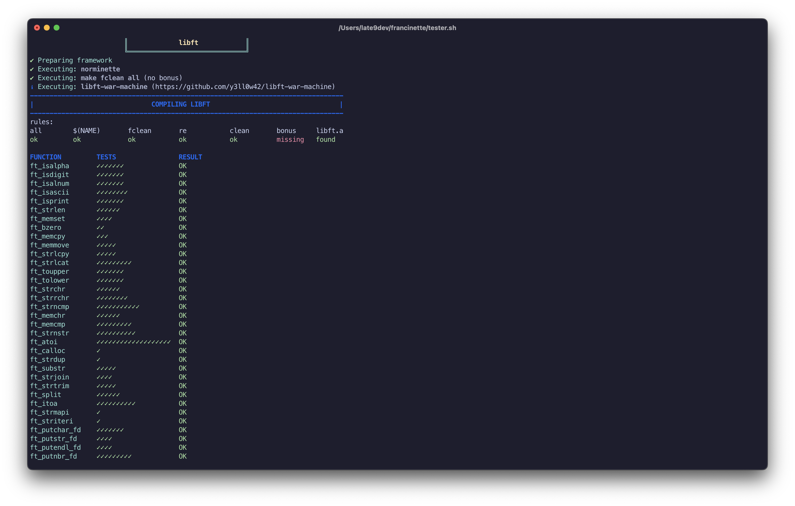
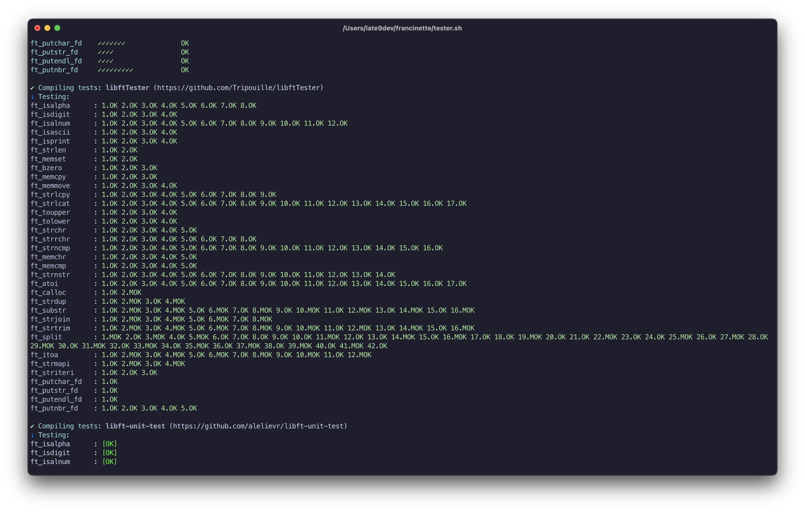
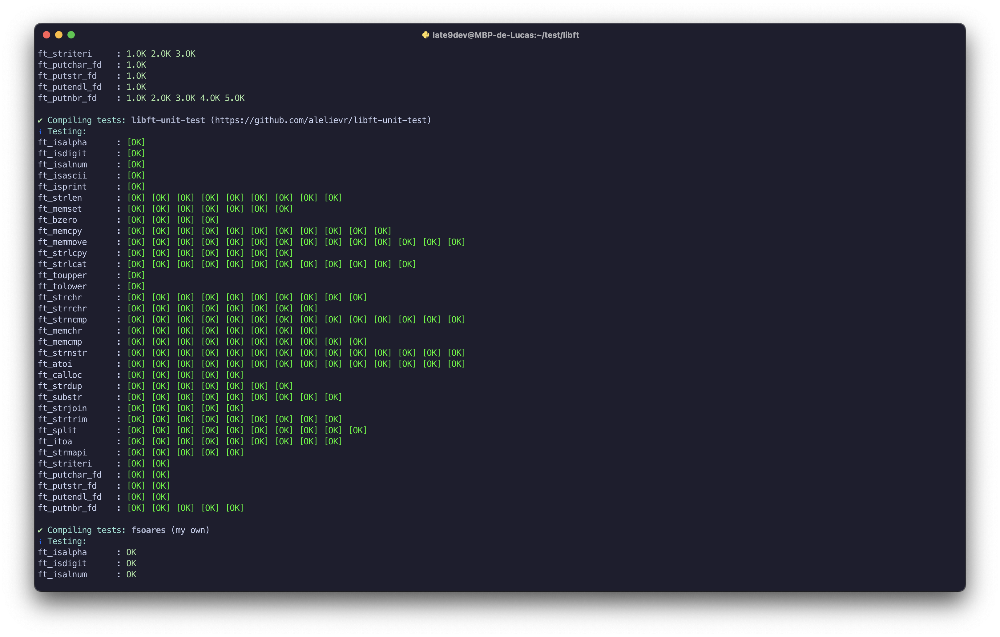
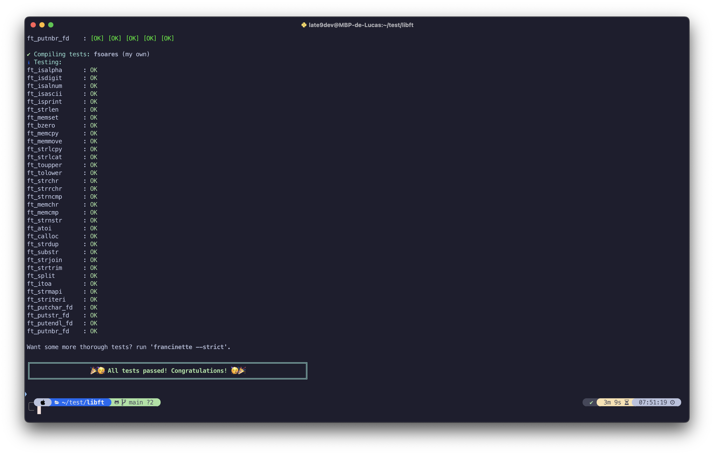

<h1 align="center" style="display: none">42 libft</h1>

<picture>
  <source media="(prefers-color-scheme: dark)" srcset="./ressources/github-readme-banner-libft-light.png">
  <source media="(prefers-color-scheme: light)" srcset="./ressources/github-readme-banner-libft-dark.png">
  
</picture>

<p align="center">
	<b>
		<a href="#about">About</a>
		<span> · </span>
		<a href="#how-to-use">How to use</a>
		<span> · </span>
		<a href="#test">Test</a>
	</b>
</p>

<p align="center">
	
	
</p>

## About

`Libft` is an introductory project at [42](https://42.fr) that involves creating your own C library, compiling a collection of standard and additional functions that can be reused in later projects. This foundational project lays the groundwork for understanding basic data structures, [memory allocation](https://youtu.be/MIL2BK02X8A?si=DAC4B3Nw32vwGhIu), string manipulation, and much more, providing a solid base for all future C programming tasks.

## How to use

### Clone the repository

```bash
git clone https://github.com/late9dev/42_libft.git libft
```

```bash
cd libft && make
```

### Create a test

```bash
vim test.c
```

```c
#include "libft.h"

int	main(void)
{
	/*Test all the functions you want */
	ft_putstr_fd("Hello World !", 1);
	ft_putchar_fd('\n', 1);
	return (0);
}
```

### Compile & run

```bash
gcc -Wall -Wextra -Werror test.c -o test -L. -lft && ./test
```

## Test

I passed all the mandatory [Francinette](https://github.com/xicodomingues/francinette) tests.









---

<div align="center">
	<i>By a Student of <a href="https://42.fr"><b>42 Paris</b></a>.</i>
</div>